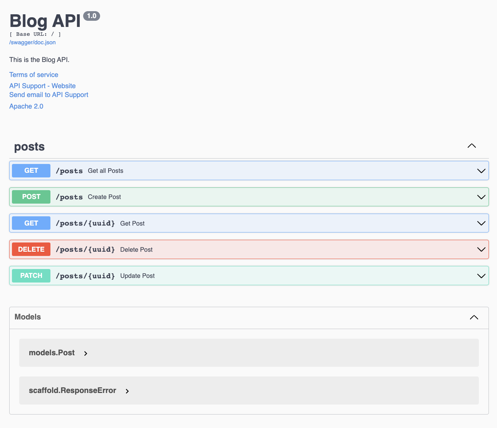

# Getting Started with Scaffold

This guide covers getting up and running with Scaffold Framework

After reading this guide, you will know:

- ✅ How to install Scaffold, create a new Scaffold application and connect your application to a database.
- ✅ The general layout of a Scaffold application.
- ✅ How to quickly generate components of a Scaffold application

## 1. What is Scaffold

Scaffold is a web application development framework written in the Go programming language and strongly inspired (a.k.a clone like 🐑) by the Ruby On Rails framework. This is very clear with this documentation that aims to be the closest as possible as the original one.

The biggest difference is that regardless the language that is Go instead of Ruby - Scaffold focus on the implementation of RESTful **API**s (even we can still render HTML tags)

## 2. Creating a Scaffold Project

By following along with this guide, you'll create a Scaffold project called `blog`

### 2.1 Installing Scaffold

Before you install Scaffold, you should check to make sure that your system has the proper prerequisites installed. These include:

- Go
- Make
- SQLite3

### 2.2 Creating the Blog Application

Scaffold comes with a number of scripts called generators that are designed to make your development life easier. One of these is the `new` generator that creates the initial application boilerplate.

To use this generator, on a terminal run:

```bash
scaffold new blog
```

This will create a Scaffold application called Blog in a `blog` directory and install the required dependencies.

After you create the blog application, switch to its folder:

```bash
cd blog
```

The `blog` directory will have a number of generated files and folders that make up the structure of a Scaffold application.

| File/Folder   | Purpose                                                                                                                           |
| ------------- | --------------------------------------------------------------------------------------------------------------------------------- |
| app/          | Contains the models, services and helpers for your application. This is the main application folder                               |
| api/          | Contains the controllers and Swagger (auto generated) definitions                                                                 |
| cmd/          | Contains the scaffold script that starts your app and can contain other commands you could create                                 |
| config/       | Contains configuration for your application, database, and more                                                                   |
| db/           | This folder is only created when you're using SQLite as the default database without changing its default path (with: `DB_PATH=`) |
| go.mod go.sum | The files with the needed dependencies and version locks for your application                                                     |
| Makefile      | This file contains tasks that can be run from the command line to handle your application                                         |

## 3. Hello, Scaffold

To begin with, let's see our initial Hello World.

### 3.1 Starting up the Web Server

You actually have a functional Scaffold application already. To see it, start the web server with the command:

```bash
make dev
```

To see your application in action, open a browser window and navigate to http://localhost:4000/index. You should see the default page: **It's Scaffolding** (or a JSON version at http://localhost:4000/index.json).

### 3.2 How to handle Controllers

You're seeing this content because of the default **IndexController** (this controller is not mandatory, you can safely remove it).

All controllers must be initialized at `api/api.go` (e.g: IndexController):

```go {5}
func NewAPI(application *config.Application) (api *API) {
	api = &API{Application: application, Router: scaffold.NewRouter(nil)}
	swagger.UseSwagger(api.Router)

	controllers.NewIndexController(api.Router)

	return
}
```

Once the controller `api/controllers/index.go` is initialized you're able to register its routes:

```go {14-15}
package controllers

import (
	"net/http"

	"github.com/nanernunes/scaffold"
)

type IndexController struct {}

func NewIndexController(router *scaffold.Router) (index *IndexController) {
 	index = &IndexController{}

	router.GET("/index", index.Index)
    router.GET("/index.json", index.IndexToJSON)

	return
}

func (i *IndexController) Index(c *scaffold.Context) {
    c.RenderText(http.StatusOK, "It's Scaffolding!")
}

func (i *IndexController) IndexToJSON(c *scaffold.Context) {
	c.Render(http.StatusOK, struct{ Body string }{Body: "JSON Content!"})
}
```

### 3.3 How to handle Responses

Scaffold comes with some useful Renders under the `scaffold.Context` struct:

#### Render

Parse the objects as JSON (application/json)

```go
c.Render(200, []string{"scaffold", "framework"})
```

```json
["scaffold", "framework"]
```

#### RenderText

Response with text value (plain/text)

```go
c.RenderText(200, "Scaffold Framework")
```

```text
Scaffold Framework
```

#### RenderHTML

Render the content in HTML (text/html)

```go
c.RenderHTML(200, "Scaffold<br />Framework!")
```

```html
Scaffold Framework!
```

## 4. Generating CRUD

This is the most powerful feature of the Scaffold framework that is generating:

- Database Model
- Database Migration
- Database & Tables
- Service (logic)
- API Controller
- JSON Serialization
- Swagger Annotations
- Swagger Files & JSON
- CRUD Routes with UUID

With just one generator; Let's create the main entity of our blog, the Post:

```go
scaffold generate Post title:string body:string author:string year:int
```

```
    create  api/controllers/posts.go
    create  app/models/post.go
    create  app/services/post.go
       run  swag fmt api/controllers/posts.go
```

Start the web server again and watch the magic happen at the Swagger documentation: http://localhost:4000



## 5. Database Settings

By design Scaffold configures a default SQLite database at `db/development.db` when you start the server. There are more drivers and settings we can define throught environment variables

### 5.1 SQLite

This is the default database driver

| Env     | Default Value       | Description                |
| ------- | ------------------- | -------------------------- |
| DB_PATH | `db/development.db` | Set a custom database path |

### 5.2 PostgreSQL

To replace the default database driver with Postgres, at `config/application.go` just change the driver `db.Sqlite` to `db.Postgres` and set the database envs in your environment

| Env         | Default Value       | Description       |
| ----------- | ------------------- | ----------------- |
| DB_HOST     | `localhost`         | Database Host     |
| DB_PORT     | `5432`              | Database Port     |
| DB_NAME     | `development`       | Database Name     |
| DB_USER     | `postgres`          | Database User     |
| DB_PASS     |                     | Database Password |
| DB_SSLMode  | `disable`           | SSL Mode          |
| DB_TimeZone | `America/Sao_Paulo` | TimeZone          |
